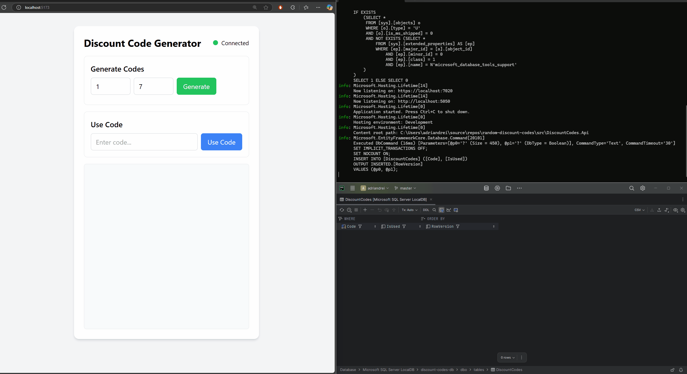

# random-discount-codes

### Components:

- `src/DiscountCodes.Api` backend built with AspNetCore, EntityFrameworkCore & .NET8. It uses a Microsoft SqlServer instance to store Discount Codes which is provisioned & migrations applied during startup. 
- `src/DiscountCodes.Client` frontend (built with help from LLM, I am not a frontend engineer but wanted to present a visual client as well)
- `tests/DiscountCodes.Tests` functional & unit tests.

### Local setup & running backend & frontend:

- clone repository

```
git clone https://github.com/adriandrei/random-discount-codes
```

- open ``DiscountCodes.sln`` in Visual Studio (tested 17.12.3) or Rider (tested 2024.3.2).
- set `DiscountCodes.Api` as Startup project and run the solution (F5).
- open a terminal in `src/DiscountCodes.Client` folder and run the following commands:

```
npm install
npm run dev
```

- open the link provided by the Vite url to the client application.
- if the client is successfully connected via SignalR to the backend, there should be the `Connected` indicator at the top right corner.

### Troubleshooting
- By default, the backend starts on port `5050`. If this port is used by another aplication, make note of the new port and update the value in the client's `main.ts` file.



## Functional requirements considerations:

Let's have a closer look at the `DiscountCodesService` class as it encapsulates most of the business logic which should
cater to our functional requirements.
One of them is to always generate unique discount codes and for this we use the method `GenerateRandomCode` which
generates a random string of a specified length using a cryptographically secure random number generator. With the
current symbol source `ABCDEFGHIJKLMNOPQRSTUVWXYZabcdefghijklmnopqrstuvwxyz0123456789`, we can generate 62<sup>7</sup>
combinations for 7 length codes or 62<sup>8</sup> combinations for 8 length codes. If this is not plenty, we can further
add additional symbols. Alternatively, we can swap this implementation for different ones to better suit our needs (
maybe this one exhausts values too quickly or computes existing codes too often, more testing would be required).

When it comes to storing the discount codes to the database, there are different ways to achieve it. The current
implementation is an optimistic one which trades the need to validate each code individually and attempts to insert a
batch of new codes in a single transaction; if this fails, we then check which codes already exists and only regenerate
new values for those and attempts to save them again. An even more robust solution would extract this "check how many
exists and regenerate them again" and retry it several times (configurable number) before exiting. An example would be to try to generate 100, error out while discovering that 10 are already used, save the 90 and proceed to regenerate 10 and save them followed again by 5 being already used and so on. This approach
minimizes the number of db calls for optimal performance. At the other end however, we could go the route of
individually checking each and every newly generated code before adding it to the list of commitable codes, but this
approach would make as many round trips just for uniqueness validation as there are codes to generate which would
severely impact performance. Furthermore, in a multi instance scenario, the possibility of another instance committing a
newly generated codes before the current instance is also a risk, which means that no solution is perfect and trade-offs
might need to be made based on other functional & non-functional requirements.

In order to guarantee that codes are not reused and avoid a racing condition we employ the use of optimistic concurrency
strategy by making use of Microsoft's SqlServer capability to mark a column as a concurrency token which is
automatically generated by the database whenever a non-idempotent operation is executed against the row. This ensures
that even if 2 clients make use of the code roughly at the same time and both their requests reach
`DiscountCodesService`'s `UseCodeInternal` post retrieval code, only the first one to commit the entity changes back will
succeed as the other will receive a `DbUpdateConcurrencyException` (scenario explored in the
`DiscountCodesServiceTests`)

## Tests

- Running the tests can be achieved both from Visual Studio or Rider (or optionally via cmd);
- Tests are making use of TestContainers which spins up a Microsoft SQL Server instance in Docker.
- `DiscountCodesHubTests` builds & starts the application and also creates a SignalR connection to the instance in order
  to send `GenerateRequest` and `UseCodeRequest` messages for both existing and non-existing codes. Additionally, for `GenerateRequest` we also validate that the number of added discount codes to the database is indeed the number which was requested.
- `DiscountCodesServiceTests` builds a light IoC in order to test the racing condition approach when it comes to use a
  discount code discussed earlier. It makes use of a different `DiscountCodesService` method which uses the same underlying logic as the one exposed via the SignalR method, but it also exposes the capability to pass an awaitable Task (in our case, a delay of 2 seconds) after the discount code retrieval in order to simulate 2 different clients trying to use the code at the same time.


## Last words.
- Further conversations can be held around the considerations discussed around the codes generation logic & avoiding racing condition but in the absence of additional requirements, we can save these details for a live conversation about pros & cons. 
- Effort was not put into dockerizing this solution, except for the tests. Additionally more tests could be written, the ones which currently exists demostrating basic functional capabilities.